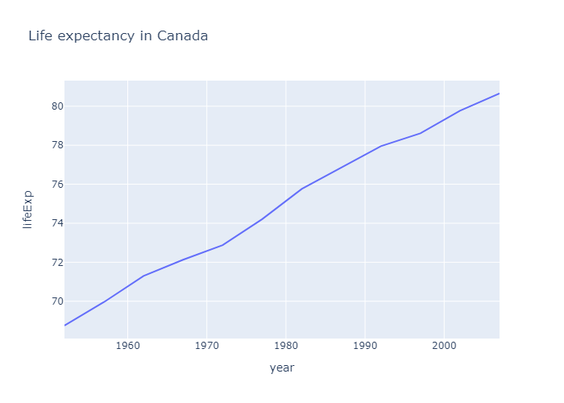

```python
import pandas as pd 
import plotly.express as px

import plotly.io as pio

pio.renderers.default = "png"
```


```python
df = px.data.gapminder().query("country=='Canada'")
fig = px.line(df, x="year", y="lifeExp", title='Life expectancy in Canada')
fig.show()
```


    

    


Render


```python
print(1254)
```

    1254
    


```python
123
```


    123


Yes this is chart
